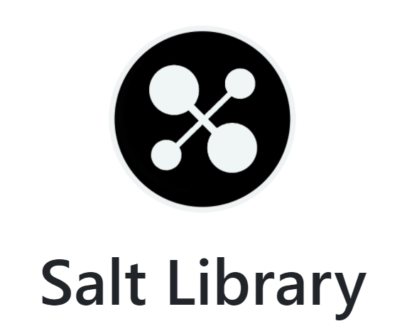

# README

## About Salt-Library



> This is a library where books taste salty!

## File Tree

本实验项目的文件树为

```txt
📦Salt-Library
 ┣ 📂docs
 ┣ 📂SQL
 ┃ ┣ 📜auth.sql
 ┃ ┣ 📜data.sql
 ┃ ┣ 📜functions.sql
 ┃ ┣ 📜ini.sql
 ┃ ┣ 📜procedures.sql
 ┃ ┣ 📜schema.sql
 ┃ ┣ 📜triggers.sql
 ┃ ┗ 📜views.sql
 ┣ 📂static
 ┃ ┣ 📜scripts.js
 ┃ ┣ 📜sl_logo.ico
 ┃ ┣ 📜sl_logo.PNG
 ┃ ┗ 📜style.css
 ┣ 📂templates
 ┃ ┣ 📜ad_search.html
 ┃ ┣ 📜base.html
 ┃ ┣ 📜book.html
 ┃ ┣ 📜books.html
 ┃ ┣ 📜cart.html
 ┃ ┣ 📜curator.html
 ┃ ┣ 📜editbook.html
 ┃ ┣ 📜editprofile.html
 ┃ ┣ 📜home.html
 ┃ ┣ 📜login.html
 ┃ ┣ 📜macros.html
 ┃ ┣ 📜miners.html
 ┃ ┣ 📜mylibrary.html
 ┃ ┣ 📜newbook.html
 ┃ ┣ 📜profile.html
 ┃ ┣ 📜requestbook.html
 ┃ ┣ 📜requests.html
 ┃ ┣ 📜sales.html
 ┃ ┣ 📜search_result.html
 ┃ ┣ 📜signup.html
 ┃ ┣ 📜sql.html
 ┃ ┗ 📜test.html
 ┣ 📜app.py
 ┣ 📜auth.py
 ┣ 📜book.py
 ┣ 📜connect.py
 ┣ 📜curator.py
 ┣ 📜miner.py
 ┣ 📜models.py
 ┣ 📜README.md
 ┗ 📜requirements.txt
```

* 其中文件夹 docs 中为大量关于此项目的文档.
* 文件夹 SQL 中为数据库脚本, 按字母顺序分别负责角色创建和授权, 初始数据导入, 函数创建, 超级管理员用户与数据库创建, 储存过程创建, 模式和索引创建, 触发器创建, 视图创建.
* 文件夹 static 中为应用静态文件.
* 文件夹 templates 中为应用页面模板脚本.
* 根目录的 Python 脚本按字母顺序分别负责应用创建, 用户的注册与登录管理, 书籍部分功能, 数据库连接, 馆长部分功能, 书友部分功能, 应用用户与角色管理.
* 根目录的 [`requirements.txt`](requirements.txt) 为该项目依赖的 Python 模块列表.

## Run

只需要简单的三步就可以运行该应用

1. 安装依赖模块

    ```shell
    pip install -r requirements.txt
    ```

2. 创建数据库

    利用数据库 `.sql` 脚本创建数据库, 执行顺序为:

    1. [`ini.sql`](SQL/ini.sql) (然后以创建的超级管理员用户进入创建的数据库)
    2. [`schema.sql`](SQL/schema.sql)
    3. [`views.sql`](SQL/views.sql)
    4. [`auth.sql`](SQL/auth.sql)
    5. [`functions.sql`](SQL/functions.sql)
    6. [`procedures.sql`](SQL/procedures.sql)
    7. [`triggers.sql`](SQL/triggers.sql)
    8. [`data.sql`](SQL/data.sql)

    具体地利用 PSQL CLI 创建数据库的指令如下 (假设已经以其他超级管理员身份登入, 按顺序**分别执行每行指令**)

    ```txt
    # \i SQL/ini.sql
    # \c saltlibrary curator
    ```

    输入密码 `SaltLibrary`

    ```txt
    # \i SQL/schema.sql
    # \i SQL/views.sql
    # \i SQL/auth.sql
    # \i SQL/functions.sql
    # \i SQL/procedures.sql
    # \i SQL/triggers.sql
    # \i SQL/date.sql
    ```

3. 运行应用

    你可以以产品模式运行本应用, 即直接运行 [`app.py`](app.py).

    ```shell
    python app.py
    ```

    你也可以以开发模式运行此应用进行进一步调试. 有两种开发模式, 一是 Flask 自带的开发模式, 分别执行以下命令

    ```shell
    set FLASK_APP=app
    set FLASK_ENV=development
    flask run
    ```

    或者你可以使用 **VS Code** 的 debug 模式. 首先你需要注释掉以 WSGI server 连接应用的语句, 取消注释以开发模式运行应用的语句, 即将 [`app.py`](app.py) 最后几行代码改为以下结果

    ```python
    # For VS Code debug mode
    app.run(use_debugger=False, use_reloader=False, passthrough_errors=True)

    # For waitress deployment mode
    from waitress import serve
    # serve(app, host="0.0.0.0", port=5000)
    ```

    同时你需要将 `launch.json` 中的配置改为以下结果

    ```json
    "configurations": [
        {
            "name": "Python: Flask",
            "type": "python",
            "request": "launch",
            "module": "app",
            "env": {
                "FLASK_APP": "app.py",
                "FLASK_ENV": "development"
            },
            "args": [],
            "jinja": true
        }
    ]
    ```

    接着直接在 VS Code 中 Run and Debug 即可. 当然你可以根据自己的需求配置 debug 模式.
