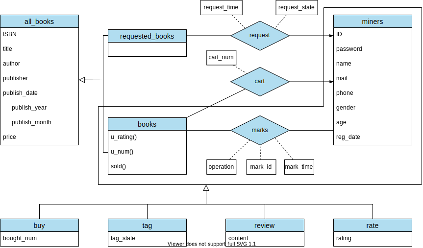
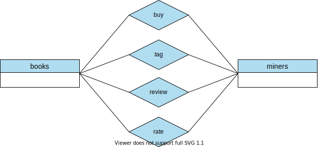

# E-R 模型设计

[[Report]]

---

我们先贴出数据库的 E-R 图

现在我们详述一下本实验数据库的 E-R 设计. 首先, 实验其实只聚焦于两个实体: 书籍 (*all_books*) 和用户 (*miners*), 然后所有的非 ISA 关系都是这两个实体之间的关系. 在后面的;;拓展性分析;;中我们提到可以增加一些实体, 如书籍的作者, 出版社; 用户的小组等, 并且增加了这些实体后会有更丰富的关系, 但这里我们省略这些拓展.

## miners

我们先来看用户实体 *miners*. 除了用户的基本信息外, *miners* 还包含属性**注册日期** *reg_date*. 这对可注册系统是一个很重要的信息, 可以帮助馆长得到一段时间内应用的注册人数, 用户平均活跃时间等信息. 同时需要指出的是, 本应用的另外两个角色 tourist 和 curator 的信息并不储存在这张表中 (`'curator'` 作为一个书友的 *ID* 存在于此表中, 但这里其不再代表管理员的身份), 因为这两个角色是应用的**元用户**, 或者说是数据库的用户 (因此它们会存在于数据库非 public schemas 的某些表中), 不属于我们的应用需要管理的用户.

## books

对于全部书籍 *all_books*, 我们使用一个**不相交特化 (disjoint specialization)** 将其分为 *books* 和 *requested_books*. 其中 *books* 指的是图书馆中**现有**的书籍, 而 *requested_books* 指的是书友们请求的图书馆**暂未包含**的书籍. 这两个实体的无交性和相对 *all_books* 的 ISA 关系是显然的. 另外, 我们将书籍基本信息中的出版日期 *publish_date* 作为了一个复合属性, 包括 *publish_year* 和 *publish_month* 两个简单/原子属性, 这是更合适的.

除了书籍的基本信息, 图书馆内的书籍还包括三个**派生属性 (derived attributes)**: 用户评分 *u_rating*, 评分人数 *u_num*, 售出数量 *sold*. 首先, 这三个属性是派生的是因为 *u_rating* 和 *u_num* 由表 *rate* 中记录完全确定; 而 *sold* 由表 *buy* 中记录完全确定. 而我们之所以选择将它们列为 *books* 的属性, 而不是需要的时候利用其他表格临时计算, 是因为我们希望这三个信息**随时跟着书名一起出现**, 即我们希望用户看到一本书的名字的同时, 就能知道它的用户平均评分怎样, 是否畅销. 这样的话, 显然临时计算的成本远大于我们预先储存算好的数据的成本. 再进一步, 如果我们假设应用书籍被评分, 购买的频率极其高, 我们还可以**惰性更新**这三个属性, 如定期更新, 或变化量达到一定阈值后更新等, 这更加符合实际.

:> 一张书卡 (book card) 的例子, 除基本信息外还会显示书籍销量和用户评分  <:

接下来我们分析一下模型中的关系, 其本质就是**书友对书籍的操作**.

## marks

我们先分析模型中巨大的**聚集关系实体 (aggregation)**, 它是本应用的核心: 标记 mark. 它首先是 *miners* 与 *books* 之间的一个关系, 然后它又是四个操作的**概化 (generalization)**

$$marks = \begin{cases}
    buy &= \{(mark\_id, bought\_num) | bought\_num \in \N\}\\
    tag &= \left\{(mark\_id, tag\_state) | tag\_state \in \{
        1: ``to read",
        2: ``reading",
        3: ``read"
    \}\right\}\\
    review &= \{(mark\_id, content)\}\\
    rate &= \left\{(mark\_id, rating) | rating \in \{1,2,3,4,5\}\right\}\\
\end{cases}$$

第一眼看上去这个聚集 + 概化的逻辑并不是很清晰, 好像我们将它们还原为 4 个独立的, 用户与书籍之间的关系会更加直接且合理.

但另一方面, 它们又确实共享了很多属性: 标记用户 *ID*, 标记书籍 *ISBN*, 标记时间 *mark_time*. 而且 4 个操作 "**ISA**" 标记的关系也非常明显. 事实上, 这里两种模型更多的是表示的不同, 它们在数据库具体的实现上并没有什么差异. 比如建立表 *marks* 的时候我们在属性对 (*operation*, *mark_id*) 上创建了**索引**, 使得同一种操作的记录在索引层面上是储存在一起的; 又比如我们为四种操作分别建立了相应的**视图 (view)**, 进一步使该模型接近于分别创建四个独立实体的情形.

除此之外, 该模型还是有很多优点的. 最重要的是, 标记 *marks* 作为一个概化后统一的实体, 能够提供分散的操作实体提供不了的有价值的信息. 比如它可以将书友的**活动**统一显示, 书友可以浏览自己近期的各种操作, 馆长可以计算书友的 "活跃指数" 等. 其次, 这种设计使得模型在逻辑上更加简洁 (ISA 关系的分层结构统一管理共有属性 VS 平行且独立无关的分散实体), 也更加符合我们应用背后的哲学: 我们首先关注的是哪个书友与哪本书产生了联系, 即这个书友**标记**了哪本书, 然后我们才想知道这个标记具体是什么操作. 再者, 这个模型或者这个哲学拥有更高的;;可拓展性;;, 比如当我们想加入某种新的操作 (如 "摘抄") 时, 我们只需要为 *marks* 创建一个新的**子类 (subclass)**, 而无需再关注这个操作跟书友是怎么联系的, 跟书籍又是怎么联系的. 这种易拓展性正是源于标记这一实体更高的层次.

## request

前面;;主要功能;;中我们反复提到, 本应用的一个创新之处在于**书籍请求系统**, 即书友可以对图书馆暂未引进的书籍进行请求. 这个系统分为以下几步

1. 书友填入请求书籍相关信息, 这些信息插入表 *requested_books* 中
2. 系统将一条请求信息插入表 *request* 中, 记录该请求的**状态**, 其中状态分为
* 待处理 pending
* 已添加 added
* 已拒绝 turned down
3. 馆长可以处理每条请求, 处理的操作有
* 直接添加, 即直接将书友填入的书籍信息加入到图书馆中
* 编辑书友填入的书籍信息
* 拒绝该请求
4. 馆长处理完一条请求, 或主动添加了一本被请求的书, 相应请求状态自动更新
5. 请求状态不再是 "待处理" 的请求对应的书籍信息自动删除

^request-system

可以看到, 请求表 *request* 和请求书籍表 *requested_books* 的关系是复杂而又紧密的. 一个请求操作发生时, 两个表同时插入一条记录, 一个记录书籍信息, 一个记录请求状态; 请求被处理后, 请求状态更新, 书籍记录被删除.

一个自然的问题是, 既然前面花了那么大篇幅介绍 *marks* 这个高层实体背后的逻辑, 为什么我们不把 *request* 作为 *marks* 的一个子类? 这里的原因其实跟我们之后在 E-R 模型[[转化为关系模式]]时**舍弃 *all_books* 实体**的原因是一致的, 即我们更关注用户与图书馆已有书籍的互动, 从而希望整个书籍请求功能独立于这个互动系统. 换句话说, *marks* 只包含书友对已有书籍的标记操作, 而 *request* 是书友对未存在书籍的标记, 跟 *marks* 没有 ISA 的从属关系. 另外, 若要将 *request* 作为 *marks* 的一个子类, 那我们需要保留实体 *all_books* 然后将 *marks* 作为 *all_books* 与 *miners* 之间的关系, 而不是现在的关系, 这对我们的应用来说是不合理的, 这在 "[[转化为关系模式]]" 部分有详细说明.

## Cart & Buy

**购物车 cart** 系统是本应用的另一大创新. 这个系统分为两步:

1. 书友将某本书籍以任意数量加入购物车
2. 在购物车界面, 书友可以选择从购物车移除任何书籍, 或者购买购物车内所有书籍

这个设计首先是符合实际和用户操作习惯的, 其次它还可以对应于原题的退货/付款系统, 即在购买之前增加了一步操作.

注意到跟 *request* 一样, 我们又一次没有将 *cart* 作为 *marks* 的子类, 这也是经过深思熟虑的. 首先我们将 *buy* 与 *marks* 设为 ISA 关系, 是因为我们强调 *buy* 的**动作属性**, 并且希望数据库永久保留这条动作记录, 以产生有价值的**统计信息**, 比如它的 *mark_time* 时间信息可以让馆长更好地分析图书馆销售情况, 让书友更好地分析自己的消费情况. 而 *cart* 类似于书籍请求系统, 更多关于的是书籍对书友的一种**暂时状态**. 我们并不关心书友将书籍加入购物车的动作, 因此它首先跟 *marks* 不会是 ISA 关系. 同时购物车信息对除书友本人以外的任何人都没有意义, 即它不能产生统计价值. 所以我们可以看到, 我们并不记录书友将书籍加入购物车的时间, 并且一旦购买完成后购物车的信息也将删除清空.
