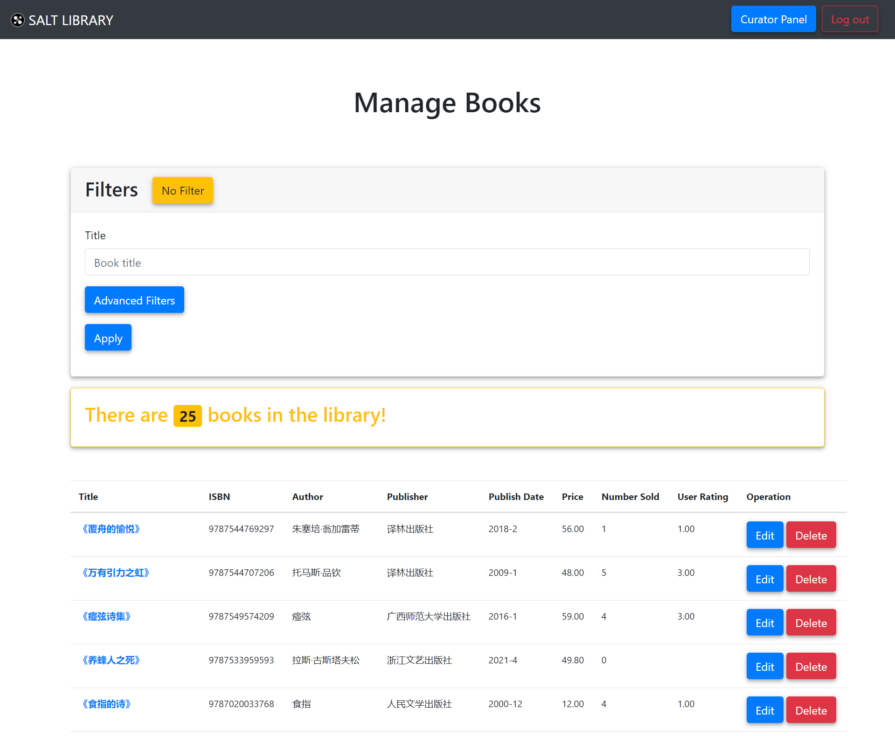

# books

# books

[[Web Pages]]

#curator

---

## Description

This page is for the curator to manage all miners, under certain filters.

## Components

* filter card
* simple result card
* result table
    * buttons

## Snapshots

:> *books* 面板的默认界面 <:

:> *books* 面板的过滤器卡片 (Filters card) (展开高级选项后) <:

:> 过滤器设置为: 出版社名字包括 "上海", 出版年份不早于 2000 年, 售价不大于 50 元, 的筛选结果 <:

## Connections

* [[book]]
* [[editbook]]
* [[deletebook]]