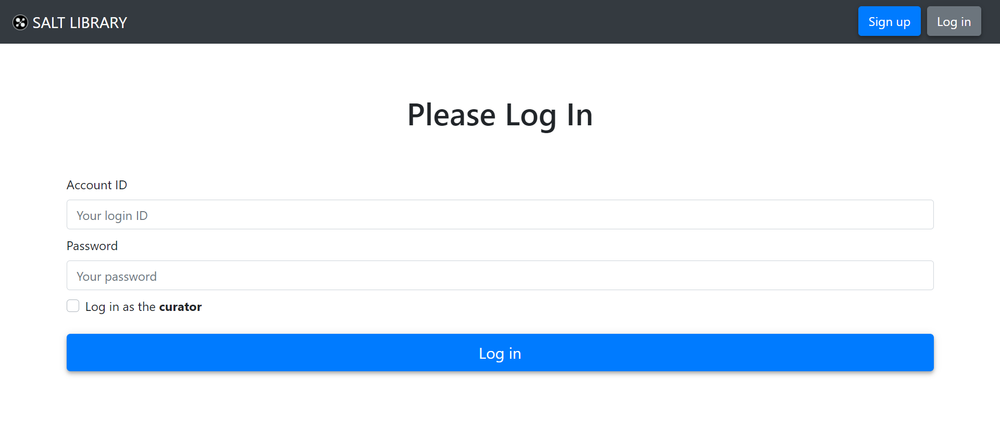

# 书友注册与登录

[[Report]]

---

当游客想使用应用的其他功能时, 它可以选择做两件事: 注册或者登录. 现在我们正式介绍一下本应用的用户管理机制, 可以归纳为 "2 + 2", 指的是**两层用户管理 + 两种用户信息储存方式**. 其中两层用户管理为

1. 应用用户管理, 由模块 Flask-Login 支持
2. 数据库角色管理

两种用户信息储存方式指的是

1. 用户的全部信息**永久**储存在数据库表 *miners* 当中, 其中密码以 **MD5 方法加密**
2. 用户登录后基本信息, 最重要的是该用户 ID, 储存在 Flask-Login 的类 `current_user` 中, 而数据库角色和数据库密码储存在应用会话 `session` 中, 两者都是**临时储存**.

这个机制的动态流程大致如下图所示


这种 "2 + 2" 的形式不仅更适合本应用, 而且极大程度地提高了应用和用户数据的安全性. 下面我们具体地来看一下该机制是怎么实现的.

## 注册

/& Page

此部分对应的页面信息为

* Page title: Sign Up
* Route: `/signup`

&/

/+ Code

此部分对应的代码为

* `auth.py` 中的 `signup()` 函数
* `signup.html`

+/

书友自主注册过程其实就是用户填写信息表格, 然后应用将该用户信息插入表 *miners* 的过程. 注册界面表格如下


这部分最关键的是**用户信息合法性的检验**. 首先我们利用 HTML form 已有的一些限制可以完成一些简单的检验, 如年龄栏填入的是否是正整数, 邮箱地址是否符合基本格式等. 然后我们再在数据传回应用的时候检查 Password 和 Confirm Password 是否相符. 最后我们调用数据库内函数 `insert_miner()` 来进行其余的完整性约束检验, 并在检验成功后添加该用户信息, 或者返回错误信息. `insert_miner()` 定义如下

```sql
/**
 * Function to check the validation of the sign up information,
 * and insert it into table miners if it is valid
 */
CREATE OR REPLACE FUNCTION insert_miners(
    id_in VARCHAR,
    pw_in VARCHAR,
    name_in VARCHAR,
    mail_in VARCHAR,
    phone_in VARCHAR,
    gender_in INT, /* gender and age are always valid thanks to HTML form constraints */
    age_in INT
)
/* Return the error message */
RETURNS VARCHAR AS $msg$
DECLARE msg VARCHAR;
BEGIN
    /* ID */
    /* PRIMARY KEY */
    IF id_in IS NULL THEN
        msg = 'ID must not be empty!';
    ELSIF id_in IN (SELECT id FROM miners) THEN
        msg = 'The input ID already exists!';
    /* CHECK pattern */
    ELSIF id_in NOT SIMILAR TO '[a-zA-Z0-9_]{1,10}' THEN
        msg = 'The input ID doesn''t match the valid pattern!';

    /* password */
    /* notice that we don't enforce the same constraint to the table,
       so this is the only chance we check the validation of the password */
    ELSIF pw_in NOT SIMILAR TO '[a-zA-Z0-9_]{4,16}' THEN
        msg = 'The input password doesn''t match the valid pattern!';

    /* name */
    /* NOT NULL */
    ELSIF name_in IS NULL THEN
        msg = 'Name must not be empty!';
    /* VARCHAR(100) */
    ELSIF CHAR_LENGTH(name_in) > 100 THEN
        msg = 'The input name is too long!';

    /* mail */
    /* CHECK pattern */
    /* Here we assume that the input mail won't be too long (>100) */
    ELSIF (mail_in IS NOT NULL) AND (mail_in NOT LIKE '%@%.%') THEN
        msg = 'The input email adress is not valid!';

    /* phone */
    /* CHECK pattern */
    ELSIF (phone_in IS NOT NULL) AND (phone_in NOT SIMILAR TO '[0-9]{11}') THEN
        msg = 'The input mobile phone number is not valid!';
    ELSE
        INSERT INTO miners(ID, password, name, mail, phone, gender, age) VALUES
            (id_in, MD5(pw_in), name_in, mail_in, phone_in, gender_in, age_in);
        msg = '';
    END IF;
    RETURN msg;
END;
$msg$ LANGUAGE plpgsql;
```

可以看到该函数清晰地检查了我们[[表格创建|创建]]表 *miners* 时施加的所有完整性约束, 除此之外还对原始密码的模式做出了要求, 使得用户设置的密码满足一定的标准化模式.

若用户输入信息违反上述任何一条限制, 则应用会停在此页面并提示错误信息, 示例如下


该机制适用于本应用所有有合法性检验的场合, 即若错误信息 `msg` 为空, 则操作成功, 网页跳转; 错误信息 `msg` 不为空, 则显示错误信息, 网页不跳转.

## 登录

/& Page

此部分对应的页面信息为

* Page title: Log In
* Route: `/login`

&/

/+ Code

此部分对应的代码为

* `auth.py` 中的 `login()` 函数
* `models.py` 中的 `User` 类
* `login.html`

+/


:> 登录界面 <:

登录过程分为三步:

1. 应用调取数据库中输入用户 ID 对应的密码.
2. 输入密码与数据库中密码匹配后, 使用 Flask-Login 的方法 `login_user()` 将用户登进应用 (此时该书友信息临时储存在类 `current_user` 中).
3. 将用户指定的角色 (可勾选馆长角色 curator, 否则为书友角色 Miner) 和相应角色的数据库密码临时储存在 session 中.

此过程主要涉及涉及两个 SQL queries

```sql
SELECT password AS pw1, MD5(request.form['password']) AS pw2
FROM miners
WHERE id = request.form['id']
```

即在调出数据库内密码的同时, 也将输入密码传入进行 MD5 方法加密, 这样才能够对比两个密码. 另一个 SQL query 是用户登录后将该书友信息调出的命令

```sql
SELECT * FROM miners WHERE id=request.form['id']
```

将书友信息储存在 `current_user` 是非常重要的, 特别是 ID 信息, 因为之后我们会广泛用到谓语 `WHERE id = current_user.id`. 虽然数据库层面上我们一般只能以整张表, 或一张表的整个属性为单位给角色[[授权]], 但是通过这条谓语使得需要的时候, 我们能够限制书友只能调取**与自己有关**信息. 换句话说, **两层用户管理实现了两层授权**, 一层是数据库层面的授权, 单位为数据库表格 (table); 一层是应用层面授权, 单位为一条数据 (tuple).

## 角色管理

/+ Code

此部分对应代码为 `models.py` 中的 `role_required()` 装饰器函数

+/

用户可以选择登录角色, 默认为 "书友 Miner", 也可勾选以馆长 curator 角色登录. 应用除了;;游客功能;;部分介绍的功能不用登陆即可使用外, 其他功能都有 "登录要求" (由 `@login_required` 装饰) 和 "角色要求" (由 `@role_required(*roles)` 装饰), 如[[书友面板]]只有书友能够访问; [[馆长面板]]只有馆长能够访问. 若登录角色没有一个页面的访问权限, 则应用会自动跳转到登录页面或用户主页. 这里又是一个 "**双层管理**", 即数据库内设有三个角色外, 应用层面也会检测用户的角色, 并赋予相应页面的访问权限.

## 退出

用户登录后可以随时通过导航栏的登出键 (Log out) 登出 (书友还可以在[[书友面板]]登出). 登出后 `current_user` 和 `session` 内的信息清空, 保证用户的信息不会泄露.