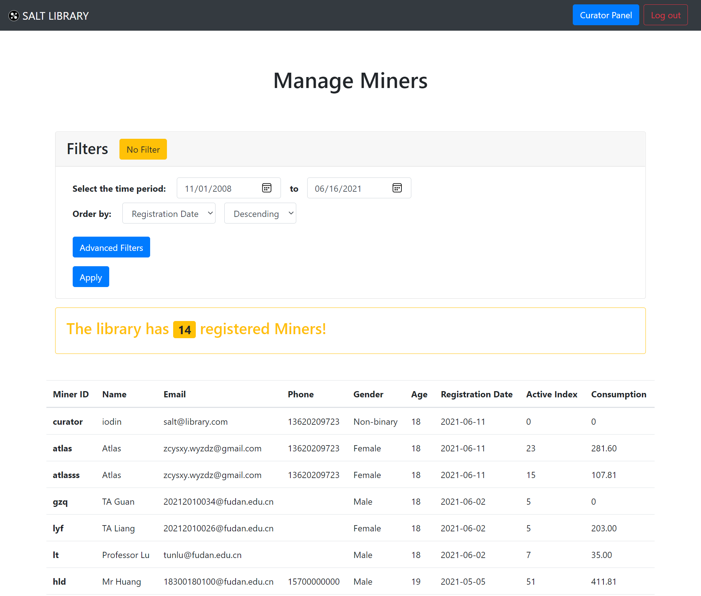
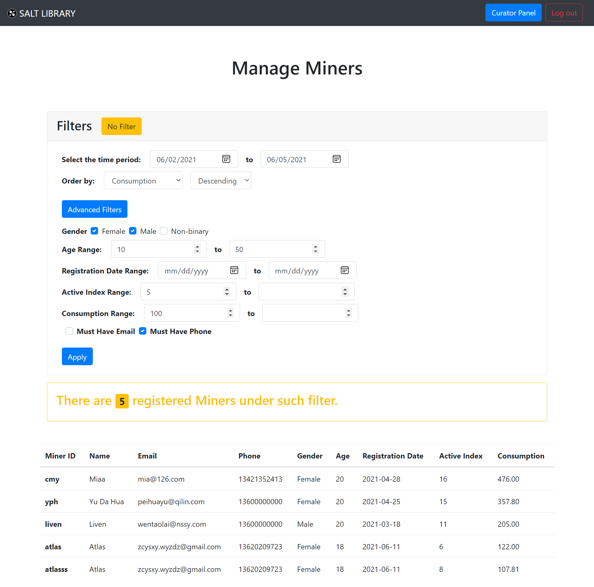

# 书友管理

[[Report]]

---

/& Page

此部分对应的页面信息为

* Page title: Manage Miners
* Route: `/miners`

&/

/+ Code

此部分对应的代码为

* `curator.py` 中的 `miners()` 函数
* `miners.html`

+/

书友管理的页面跟[[书籍管理]]的页面布局一样, 且默认显示当前图书馆所有注册书友信息. 这里书友的信息除了表 *miners* 中的基本信息外, 还有两个派生属性:

* 活跃指数 Active Index: 一段时间内书友的标记操作数
* 消费 Consumption: 一段时间内书友的消费总额

它们由查询表 *miners* **自然左外连接 `NATURAL LEFT OUTER JOIN`** *marks* 和 *buy_view* 得到.

:> *miners* 面板的默认界面, 显示图书馆当前所有注册书友 <:

下图是用于筛选书友的过滤器选项

:> *miners* 面板的过滤器卡片 (Filters card) (展开后) <:

与[[高级搜索]]的逻辑一样, 这里的过滤筛选其实就是**增加 SQL query 中的谓词**. 但是不同于书籍查询只涉及一个表 *books* 的情况, 这里的查询涉及多个表和视图, 不再能够进行谓词的简单线性叠加. 因此我们这里采取的方式是 "默认值 + 输入", 即若过滤器选项有输入或更改, 则 SQL 语句中填入输入值, 否则填入默认值. 具体的实现平凡但繁琐, 故不贴出, 详见 ;;`curator.py` 中的 `miners()` 函数;;. 下图为一个筛选示例.

:> 过滤器设置为: 性别限女性和男性, 年龄不小于 10 周岁, 在 06/02/2021-06/05/2021 时间段内活跃指数不小于 5, 消费金额不少于 100 元, 的筛选结果 <:
