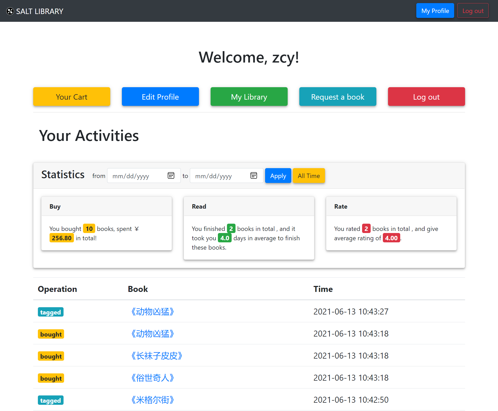

# 书友面板

[[Report]]

---

/& Page

此部分对应的页面信息为

* Page title: Profile
* Route: `/profile`

&/

/+ Code

此部分对应的代码为

* `miner.py` 中的 `profile()` 函数
* `profile.html`

+/

书友面板是书友登录后直接导向的页面, 也是登录后一直可以通过导航栏 (navbar) 直接跳转到的页面. 其作为书友的 "主页" 由两部分组成: 主要功能按钮和书友活动信息.



其中主要功能按钮使书友可以通过书友面板跳转到以下功能页面

* [[购物车]]
* [[修改用户信息]]
* [[我的图书馆]]
* [[请求书籍]]
* 登出

再进入这些功能的介绍之前我们先来看一下这一页面的另一大部分, 即书友活动信息 (Your Activities). 这部分又分为两块, 一是**统计卡片 (Statistics)**, 然后是活动列表.

统计卡片展示的是基于一段时间内用户的标记活动产生的统计信息, 目前有

* 购买统计量, 包括购买书籍数目和总消费额
* 阅读统计量, 包括读完书籍数目和读完这些书平均花费的时间
* 评分统计量, 包括评分书籍数目和这些评分的平均值

这三个统计量分别由以下 SQL queries 给出

```sql
/* buy */
SELECT
    COALESCE(SUM(bought_num),0) AS bought_num,
    COALESCE(SUM(bought_num * price),0) AS bought_sum
FROM (
        SELECT bought_num, isbn
        FROM buy_view
        WHERE (id = %s) AND (bought_date BETWEEN %s AND %s)
    ) AS r NATURAL JOIN books

/* read */
SELECT COUNT(*) AS book_num, ROUND(AVG(read_time(%s, mark_id)),1) AS book_time
FROM (SELECT * FROM tag WHERE tag_state = 3) AS r NATURAL JOIN marks
WHERE (id = current_user['id']) AND (DATE(mark_time) BETWEEN %s AND %s)

/* rate */
SELECT COUNT(*) AS rate_num, ROUND(AVG(rating),2) AS avg_rating
FROM rate_view
WHERE (id = current_user['id']) AND (rate_time BETWEEN %s AND %s)
```

可以看出这些 queries 主要在干两件事:

1. 选取操作试图中当前书友在给定时间段内的操作信息
2. 利用**聚集函数 (aggregate function)** 计算统计量

其中获得阅读统计时我们没有用视图 *tag_view*, 是因为我们要获得操作记录的 *mark_id*, 作为函数 `read_time()` 的传入参数以获得**阅读时间**. 这里我们定义一本书的阅读时间为**用户购买此书到标记其为 "读完" 的时间区间**. `read_time()` 定义如下

```sql
/**
 * Function to calculate the time spent by someone to finish a book,
 * which is the time span between they tag it reading and read,
 * or the time span between they bought it and tag it read
 */
CREATE OR REPLACE FUNCTION read_time(
    id_in VARCHAR,
    mark_id_in INT
)
/* Return the message */
RETURNS INT AS $ts$
DECLARE ts INT;
DECLARE isbn_temp CHAR(13);
DECLARE date_end DATE;
DECLARE date_start DATE;
BEGIN
    /* Get the ISBN of the book  */
    SELECT isbn, DATE(mark_time) INTO isbn_temp, date_end
    FROM marks
    WHERE mark_id = mark_id_in;

    /* We take the date they bought the books as the start date*/
    SELECT DATE(mark_time) INTO date_start
    FROM marks
    WHERE id=id_in AND isbn=isbn_temp AND operation=1;

    /* Calculate the time span */
    ts = 1 + DATE_PART('DAY', date_end::TIMESTAMP - date_start::TIMESTAMP);
    RETURN ts;
END;
$ts$ LANGUAGE plpgsql;
```

注意, 有价值的统计信息远不止这三个, 这也是我们将其设计为卡片形式的寓意所在, 即我们希望这个系统可以方便地添加各种有用的统计信息, 甚至可以发展成为一个书友可以自行设计统计量的系统 (类似于 [[原始 SQL]] 的实现方式). 当有新的统计量引入时, 在面板中添加一个卡片即可, 这使得系统有极强的;;可拓展性;;.

最后, 下面的活动列表以表格 (table) 的形式列出书友指明时间段内书友的活动记录供书友参考, 活动记录由查询视图 `mark_book_view` 得到.
