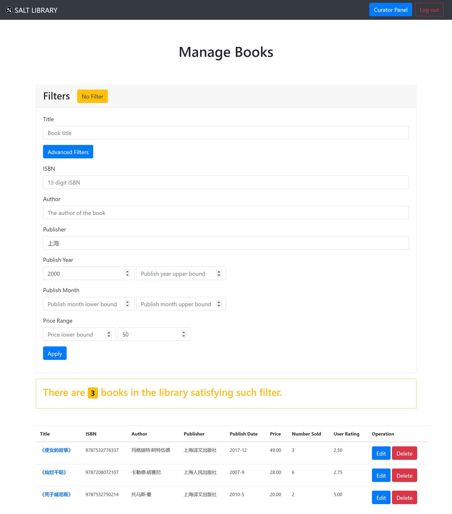

# 书籍管理

[[Report]]

---

/& Page

此部分对应的页面信息为

* Page title: Manage Books
* Route: `/books`

&/

/+ Code

此部分对应的代码为

* `curator.py` 中的 `books()` 函数
* `books.html`

+/

对于图书馆馆长, 应用提供的最基本的功能自然是书籍管理. 书籍管理页面分为三部分

1. 过滤器卡 Filters
2. 简单的统计结果卡
3. 完整结果表格

这也是所有**管理页面** (书友管理, 销售管理等) 的统一布局.

这里的过滤器其实就是[[高级搜索]]中的表格, 没有任何改动, 因为此表格的完整性也无需任何改动. 而统计结果卡和结果表格显示的就是该过滤器条件下书籍的数目和所有书籍信息.

:> 无任何过滤条件的默认界面, 显示图书馆内所有书籍 <:

:> 过滤器设置为: 出版社名字包括 "上海", 出版年份不早于 2000 年, 售价不大于 50 元, 的筛选结果 <:

获得书籍信息后, 对于每本书馆长有两个操作选项: 编辑或删除. 这也是馆长登录后在[[书籍页面]]会看到的两个按钮. 删除操作很好理解, 即将该书从图书馆删除, 具体地包括从表 *books* 移除该书信息, 并将与该书有关的所有记录 (如购物车记录, 标记记录) 删除 (由 `ON DELETE CASCADE` 自动删除).

而点击编辑按钮则跳转到书籍编辑页面.

## 编辑书籍信息

/& Page

此部分对应的页面信息为

* Page title: Edit Book
* Route: `/<isbn>/edit`

&/

/+ Code

此部分对应的代码为

* `book.py` 中的 `editbook()` 函数
* `editbook.html`

+/

编辑书籍与[[请求书籍]]页面几乎一模一样, 除了编辑书籍会自动填入当前信息. 并且同样的, 输入信息更新前应用会调用检查函数 `check_book()` 来检验输入信息是否合法. 但值得注意的是, 这里我们调用 `check_book()` 时需将传入参数 `edit` 改为 `TRUE`, 这样函数将跳过**书籍是否已存在**的检查, 这是自然的, 因为我们编辑的就是已有的书籍的信息.