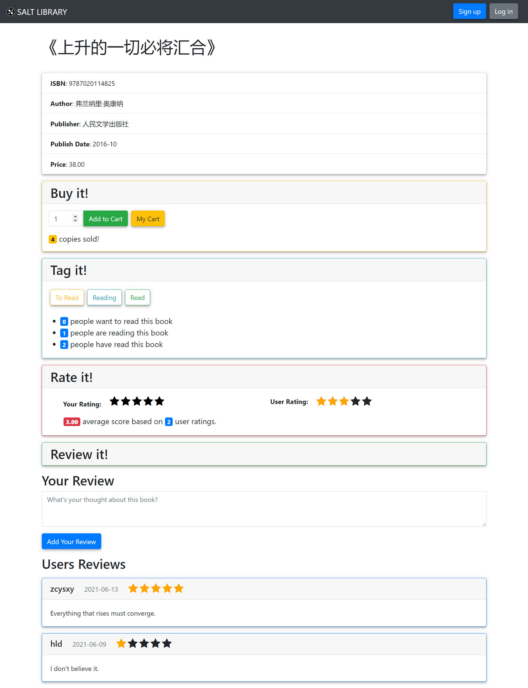

# 书籍页面

[[Report]]

---

/& Page

此部分对应的页面信息为

* Page title: 《书名》
* Route: `/<isbn>`

&/

/+ Code

此部分对应的代码为

* `book.py` 中的 `book_info()` 函数
* `book.html`

+/

本应用中任何出现**书名**的地方, 点击都能进入对应的书籍页面. 书籍页面由以下部分组成

* 基本信息
* 馆长操作 (Edit 和 Delete 按钮, 以馆长身份登录后出现)
* 购买操作和信息 Buy it!
* 标签操作和信息 Tag it!
* 评分操作和信息 Rate it!
* 评论操作和信息 Review it!



上图显示的是以**游客**身份查看的书籍页面, 可以看到除馆长操作外所有书籍信息都会显示, 但是游客点击任何操作按钮时应用会自动跳转到登陆界面, 提示用户需要登录后才能进行相应操作.

书籍信息中的基本信息, 销量 (`sold`), 用户评分 (`u_rating`), 和评分人数 (`u_num`) 即书籍储存在表 *books* 中的基本信息, 通过一个简单的, 需重复调用的函数获得

```python
def get_book(isbn):
    '''A simple function to get the book info from its ISBN'''

    con = Connect()
    content = con.query('SELECT * FROM books where isbn = %s', [str(isbn)], 1)

    if content is None:
        abort(404)

    return content
```

该函数通过书籍的 ISBN 以游客身份获取书籍信息, 若书籍不存在则导向 404 页面.

用户标签统计信息 (即有多少书友标记了该书为什么状态) 和所有用户评论则分别从[[视图]] `tag_view` 和 `review_view` 中查询. 这里只展示一下获取用户评论的查询语句

```sql
SELECT content, id, review_date, rating
FROM review_view NATURAL LEFT OUTER JOIN rate_view
WHERE isbn = %s
ORDER BY review_date DESC
```

可以看到该语句不仅获取了所有对应书籍的书友评论, 还在该书友同时给这本书打分了的情况下获取了其评分, 同时将所有评论按时间顺序排列. 标签的统计信息类似获得.

所有这些基本信息之外的**用户信息**是本应用的亮点, 它们是一本书的重要信息, 使得所有用户都能够参考其他人是如何标记此书的.
