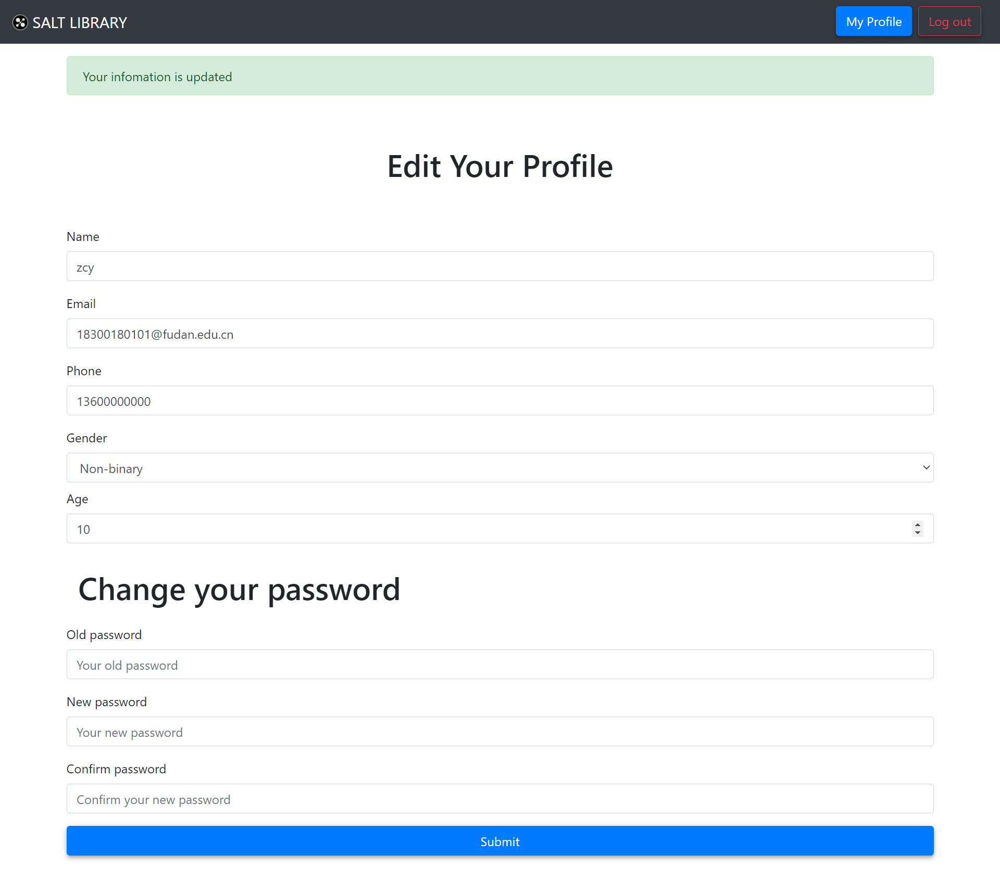

# 修改用户信息

[[Report]]

---

/& Page

此部分对应的页面信息为

* Page title: Edit Profile
* Route: `/editprofile`

&/

/+ Code

此部分对应的代码为

* `miner.py` 中的 `editprofile()` 函数
* `editprofile.html`

+/

书友登录后可以修改用户信息, **包括重设密码**. 修改用户信息界面与[[书友注册与登录#注册]]类似, 都是一整张表格, 示例如下



同样的, 这部分的关键是对更新信息的检验, 所以自然地会想到可以利用[[书友注册与登录#注册]]时使用的 `insert_miner()` 函数. 但是这里需要更多的考虑, 如此时 `NOT NULL` 限制的数据已经满足约束, 故若更新信息违反此约束我们直接不更新即可, 不必判断为错误. 另外还要考虑重设密码的检验, 如原密码必须正确才能更新密码等. 因此我们重新定义了一个函数 `update_miner()`, 代码如下

```sql
/**
 * Function to check the validation of the profile update information,
 * and update it if valid
 */
CREATE OR REPLACE FUNCTION update_miners(
    id_in VARCHAR,
    old_pw_in VARCHAR,
    new_pw_in VARCHAR,
    name_in VARCHAR,
    mail_in VARCHAR,
    phone_in VARCHAR,
    gender_in INT,
    age_in INT
)
/* Return the error message */
RETURNS VARCHAR AS $msg$
DECLARE msg VARCHAR;
BEGIN
    /* password */
    IF new_pw_in IS NOT NULL AND old_pw_in IS NULL THEN
        msg = 'The old password is needed!';
    ELSIF ((new_pw_in IS NOT NULL) AND (MD5(old_pw_in) <> (SELECT password FROM miners WHERE id=id_in))) THEN
        msg = 'The old password is not correct!';
    ELSIF (new_pw_in IS NOT NULL) AND (new_pw_in NOT SIMILAR TO '[a-zA-Z0-9_]{4,16}') THEN
        msg = 'The new password doesn''t match the valid pattern!';
    /* name */
    ELSIF CHAR_LENGTH(name_in) > 100 THEN
        msg = 'The input name is too long!';
    /* mail */
    ELSIF (mail_in IS NOT NULL) AND (mail_in NOT LIKE '%@%.%') THEN
        msg = 'The input email adress is not valid!';
    /* phone */
    ELSIF (phone_in IS NOT NULL) AND (phone_in NOT SIMILAR TO '[0-9]{11}') THEN
        msg = 'The input mobile phone number is not valid!';
    ELSE
        UPDATE miners
        SET
            /* COALESCE returns the first argument that is not null */
            password = COALESCE(MD5(new_pw_in), password),
            name = COALESCE(name_in, name),
            mail = mail_in,
            phone = phone_in,
            gender = gender_in,
            age = age_in
        WHERE id = id_in;
        msg = '';
    END IF;
    RETURN msg;
END;
$msg$ LANGUAGE plpgsql;
```