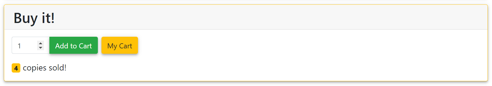

# 加入购物车

[[Report]]

---

/+

此部分对应的代码为 `book.py` 中的 `add2cart()` 函数.

+/

书友登录后就可以将书籍加入购物车了. 在[[书籍页面]]书友可以选择加入购物车份数, 并可以直接进入 "我的购物车 (cart)".



应用通过执行以下 SQL 命令将书籍加入书友购物车

```sql
INSERT INTO cart VALUES (isbn, current_user['id'], request.form['num'])
ON CONFLICT (isbn, id)
DO UPDATE SET cart_num = cart.cart_num + EXCLUDED.cart_num
```

其中值得注意的是 `ON CONFLICT ... DO UPDATE` 语句, 它是为了保证用户重复添加某一本书到购物车时, 表 *cart* 不是添加新的记录, 而是更新原记录的书籍份数 *cart_num*.
