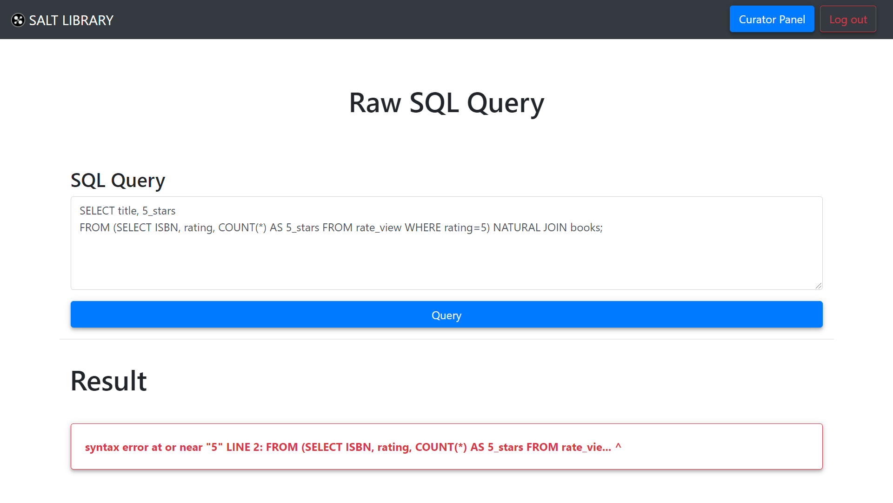
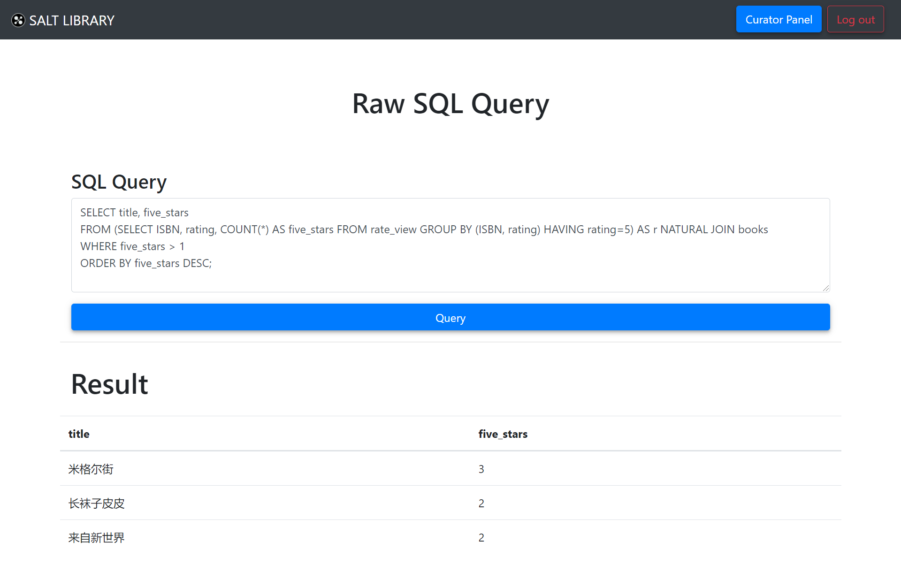

# 原始 SQL

[[Report]]

---

/& Page

此部分对应的页面信息为

* Page title: SQL
* Route: `/sql`

&/

/+ Code

此部分对应的代码为

* `curator.py` 中的 `sql()` 函数
* `sql.html`

+/

原始 SQL 查询 (Raw SQL Query) 是本应用的一个 "彩蛋" 功能, 它其实就是直接调用类 `Connect` 的 `.query()` 方法将馆长输入的 SQL query 传递给数据库, 然后以表格的形式展示查询结果, 或直接显示错误信息. 例子如下

:> 输入 SQL 有语法错误时, 直接显示 PSQL 的错误信息 <:

:> 以表格的形式呈现查询结果 <:

这个功能虽然简单, 却有以下几个重要优点

* 增加了应用的灵活性. 即如果馆长需要获得其他功能暂时未能提供的信息, 则可以自己构造查询语句来查询数据.
* 预示着应用的高可拓展性. 比如我们可以利用相似的方法, 将用户**自定义的查询语句**储存到应用中 (可以创建一个新的视图), 然后其查询结果可以以卡片的形式加入到任何地方, 比如[[书友面板]]的统计卡片中.