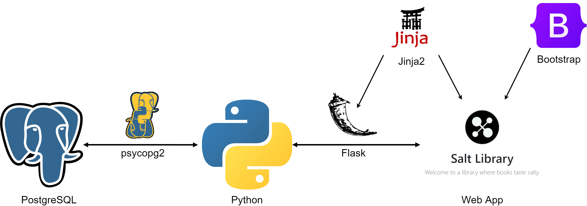
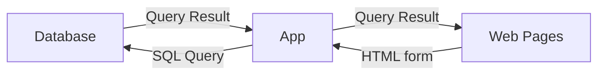

# 开发环境

[[Report]]

---

现列出本实验项目的开发环境

* 操作系统: Window 10
* 数据库管理软件: PostgreSQL
* 编程语言: Python
* 数据库接口: psycopg2
* Web 开发框架: Flask
* HTML 模板引擎: Jinja2
* 前端框架: Bootstrap

!! 本报告之后简记 PostgreSQL 为 PSQL

它们的关系示意图如下

先列出一些具体的开发细节

* 开发环境
    * 开发环境为 Python 虚拟环境 (venv).
    * 开发模式为 VS Code 的 Debug 模式, 而非 Flask 的 Debug 模式.
* 数据库连接
    * 开发并未使用 SQLAlchemy 等 Object Relational Mapper 来处理数据库, 因为这样就用不上 SQL 语言了, 与实验目的相背.
    * 开发并未迁移数据库, 即应用数据库仍在 PSQL 原始数据库丛 (database cluster) 中, 应用只通过接口与数据库相连
    * 数据库初始化及函数创建等**非应用使用过程**的数据库操作均采用 PSQL 直接运行 `.sql` 脚本的方式实现. 我们自然可以也利用 psycopg2 接口用 Python 实现这些操作, 但这样做意义不大, 我们希望 psycopg2 是**应用与数据库**的连接器, 而无需是应用开发过程中的连接器.
    * 应用后端数据的验证与修改插入等过程一般使用 PSQL 的储存过程和函数来实现, 这是因为我们希望**数据的安全性, 合法性, 连续性等性质由数据库自身来保证**, 而不是由应用或甚至前端来保证, 这样应用的稳定性和完全性更强.
* 应用使用 Flask 提供的 flask_login, session 实现应用的 session 和 login 管理, 与数据库 session 与 login 独立
* 前端重度依赖 Jinja templates & macros 和 Bootstrap 以实现统一的 UI

其实, 借助 Flask, Jinja, Bootstrap 等成熟, 方便的框架, 整个开发过程的重难点就主要集中在**应用与数据库**的连接和**网页与应用**的连接了, 前者主要是应用通过 SQL 语句查询或者修改数据; 后者主要是 HTML forms 将信息传回应用, 和应用将从数据库查询到的信息. 该过程的示意图如下

总的来说, 前者依赖的是;;**数据库**;;设计, 后者依赖的是;;**应用系统设计**;;. 这样, 整个开发过程就比较清晰了.