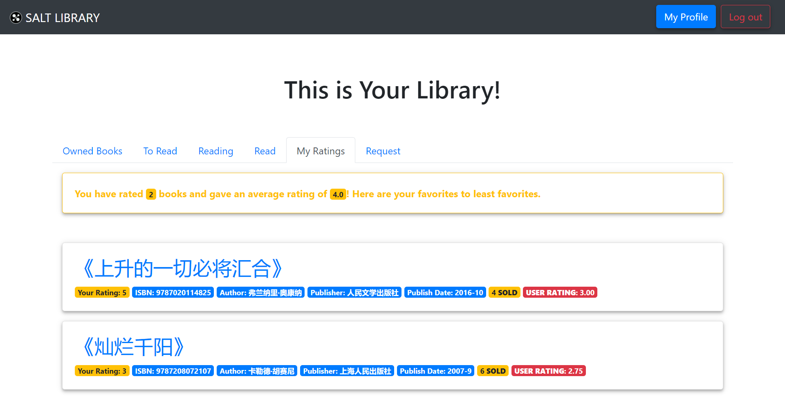
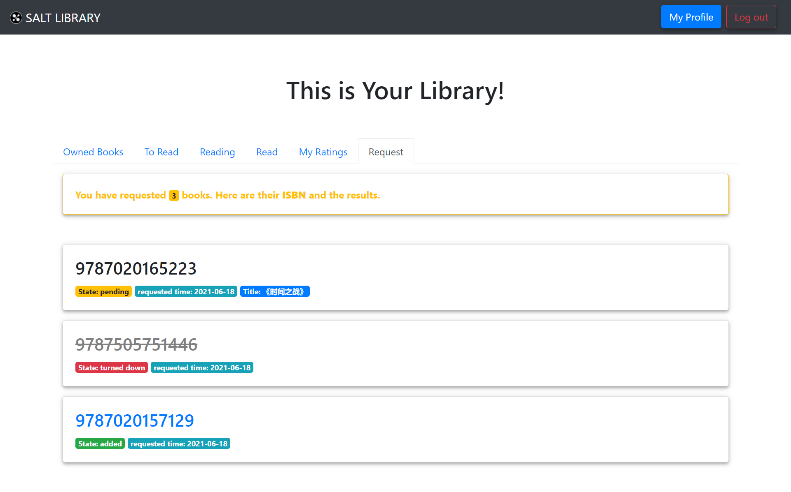

# 我的图书馆

[[Report]]

---

/& Page

此部分对应的页面信息为

* Page title: My Library
* Route: `/mylibrary`

&/

/+ Code

此部分对应的代码为

* `miner.py` 中的 `mylibrary()` 函数
* `mylibrary.html`

+/

"我的图书馆" 是本应用最核心的功能之一, 但它的内容非常浅显, 即将书友所有标记过的书籍归为以下几个分页 (tabs) (可重合) 并呈现

* 拥有的 Owned, 按购买日期降序排列
* 想读的 To Read
* 在读的 Reading
* 读过的 Read
* 评分过的 Rated, 按评分降序排列
* 请求的 Request, 按请求时间降序排列

下面展示两个 "我的图书馆" 分页的例子

:> "评分过的" 分页, 除列出打分过书籍外还会显示平均评分 <:

:> "请求的" 分页 <:

可以看到 "请求的" 分页会显示书友请求的请求状态. 对于已添加请求, 书友则可以直接点击 ISBN 码进入[[书籍页面]].

"我的图书馆" 虽然功能简单, 但概念上极其重要, 它可以说是**标记系统**的意义所在. 书友 "标记" 一本书, 无论是标上 "想读" 的标签, 还是写一条书评, 在某种程度上都是为了日后再 "找到" 这本书. 而如果没有 "我的图书馆" 的话, 书友标记完了后这个标记就失效了, 因为其没法再找到这个标记. 我们的应用是基于 "两实体一关系" 的, "我的图书馆" 就是其中关系的具象化, 换句话说, "我的图书馆" 展示的不是书籍, 而是**标记**, 而标记就是书友与书籍之间的关系.