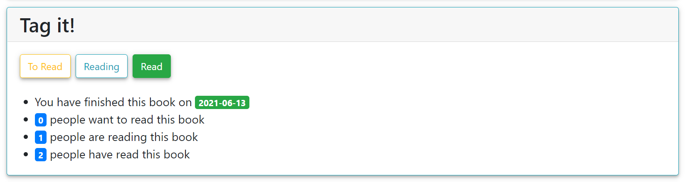

# 标签

[[Report]]

---

/+ Code

此部分对应的代码为 `book.py` 中的 `tag()` 函数.

+/

标签即书友关于一本书的 **"状态"**, 本应用设有三种状态

* 想读 To Read
* 在读 Reading
* 已读 Read

[[书籍页面]]会显示书友对该书籍的标签状态和时间信息, 即书友是何时标记本书为该状态的. 书友可以随时在[[书籍页面]]修改对一本书的标签.



应用通过调用数据库中的函数 `change_tag()` 来创建或修改一个标签. 具体地, 函数会先检查该操作是否满足 **"标签限制 (tag constraint)"**, 然后再调用**储存过程 (stored procedure) `tagging`** 来完成表格修改, 代码如下.

```sql
/**
 * Function to change the tag,
 * and check if the miner has bought the book
 * before they tag it reading or read
 */
CREATE OR REPLACE FUNCTION change_tag(
    isbn_in CHAR(13),
    id_in VARCHAR,
    tag_state_in INT
)
/* Return the error message */
RETURNS VARCHAR AS $msg$
DECLARE msg VARCHAR;
DECLARE state_txt VARCHAR;
BEGIN
    /* Transform the state value to text */
    state_txt = (
        CASE
            WHEN tag_state_in = 2 THEN '"reading"!'
            WHEN tag_state_in = 3 THEN '"read"!'
        END
    );

    /* Check before the miner tag the book reading or read */
    IF (tag_state_in=2 OR tag_state_in=3) AND NOT EXISTS (
        SELECT *
        FROM buy_view
        WHERE id=id_in AND isbn=isbn_in
    ) THEN
        msg = ('You have to buy this book first before you tag it ' || state_txt);

    /* Otherwise call the SQL procedure tagging to tag */
    ELSE
        CALL tagging(isbn_in, id_in, tag_state_in);
        msg = '';
    END IF;
    RETURN msg;
END;
$msg$ LANGUAGE plpgsql;
```

从以上代码可以看出我们的 "标签限制" 指的是**书友必须先购买一本书, 才能标记该书为 "在读" 或 "想读"**. 具体地, 若书友试图标记该书为 "在读" 或 "已读" 而未购买此书, 则函数返回错误信息 `msg`; 而若书友已经拥有此书, 或者其只是想标记该书为 "想读", 则函数调用储存过程 `tagging` 创建或修改标签. 其中储存过程定义如下

```sql
/**
 * Tag procedure
 * 1. Delete the original tuple from *tag* if exists
 * 2. Insert a tuple into *marks*
 * 3. Insert a new tuple into *tag*
 */
CREATE OR REPLACE PROCEDURE tagging(isbn_in CHAR(13), id_in VARCHAR, state_in INT)
AS $$
DECLARE new_mark_id INT;
BEGIN
    /* If there is a previous tag state, delete it */
    DELETE FROM tag
    WHERE mark_id IN (
        SELECT mark_id
        FROM marks
        WHERE isbn=isbn_in AND id=id_in AND operation=2
    );

    /* Insert a new mark */
    INSERT INTO marks(isbn, id, operation) VALUES
        (isbn_in, id_in, 2)
        RETURNING mark_id INTO new_mark_id;

    /* Insert a new tag */
    INSERT INTO tag VALUES (new_mark_id, state_in);
END;
$$ LANGUAGE plpgsql;
```

我们现在来说明一下这个过程. 首先我们在这里根据实际需求对[[E-R 模型设计|数据库设计]]做了一个调整, 即我们在 `tag` 表中**只储存书友最新的标签**, 因为我们不关心书友之前标记的状态, 而只关心每个书友现在的状态, 并且这样可以提高我们查询 `tag` 表中数据的效率. 但是我们并不删除 `marks` 表中的对应记录, 因为那是书友的活动信息. 我们对表 `rating` 和 `review` 表也做了相应的调整, 之后不再重复说明. 所以可以看到, 这个储存过程的第一步就是检查书友是否给这本书标记过状态, 若有, 则删除旧的状态. 接着该过程向表 `marks` 和 `tag` 分别插入一条新数据.

## 函数与过程

还需说明的是为什么我们这里将函数与过程分开定义, 而不是直接将过程包含在函数内. 这背后的原因使我们对函数与过程的理解: 我们认为函数是由返回值的, 它是用来**计算**某个量或**检查**某个条件的, 因此我们这里需要一个函数来检查此次标记是否满足标签限制, 而其计算或检查过程并不会对数据库产生实际影响; 而过程是用来执行一个**原子操作**的, 它是用来**改变**数据库的, 因此我们这里需要一个过程来完成新标签的创建, 而我们不需要这个操作返回任何信息. 这种理解贯穿了整个实验项目, 之后我们不再赘述.
