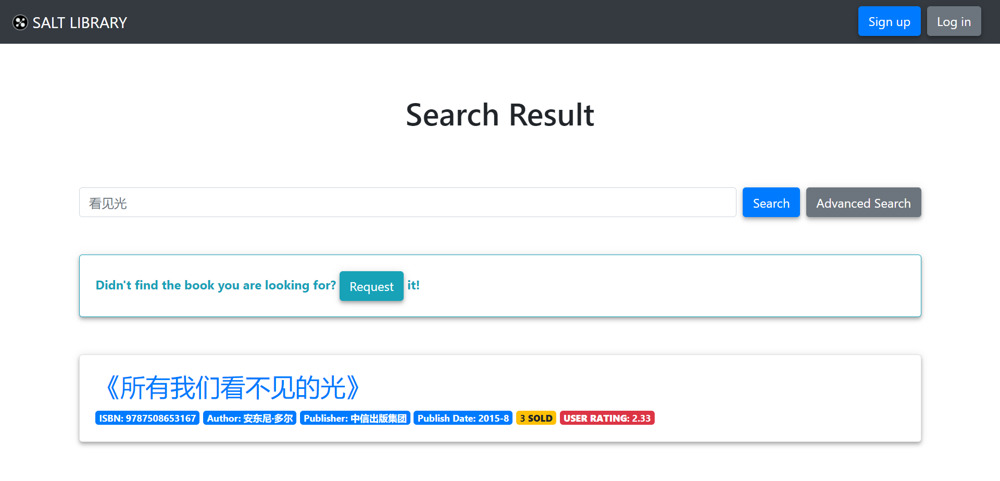

# 模糊搜索

[[Report]]

---

/& Page

此部分对应的页面信息为

* Page title: Search Result
* Route: `/search_result`

&/

/+ Code

此部分对应的代码为

* `book.py` 中的 `search_result()` 函数
* `search_result.html`

+/

书籍搜索是任何图书馆/图书数据库应用最基础的功能. 本应用提供两种搜索方法: 简单模糊搜索和[[高级搜索]]. 应用主页 *home* 提供了简单模糊搜索和[[高级搜索]]的入口. 输入查询关键词后点击其中 "Search" 按钮即可进入搜索结果页面.

模糊搜索的 "模糊" 由如下代码实现

```python
like_title = '%' + '%'.join(request.args.get('title')) + '%'
```

```sql
SELECT *
FROM books
WHERE title LIKE like_title
```

即先在输入文本中的每个字两边加上占位符 `%`, 然后查询书名符合该模式的书籍信息. 示例如下图


:> 一个模糊搜索结果 ("看见光" ≈ "所有我们看不见的光") <:

同时从 Python 代码中可以看出, 该搜索功能的输入其实是 **URL 中的参数**, 因此用户可以直接通过地址栏搜索书籍, 格式如下, 其中 `%s` 为搜索关键词

```URL
http://127.0.0.1:5000/search_result?title=%s
```