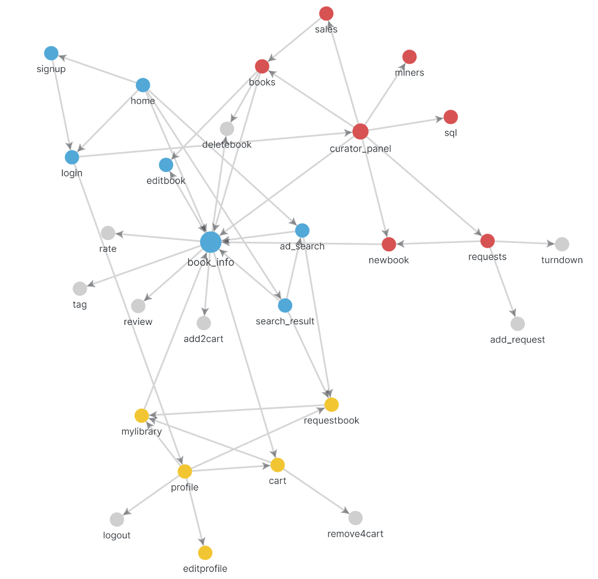
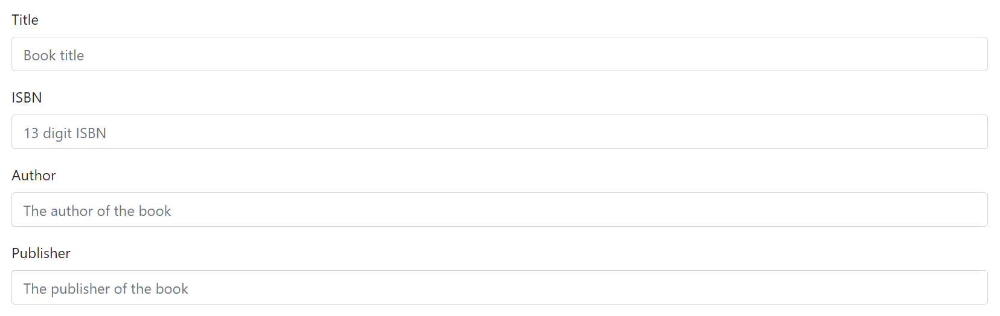
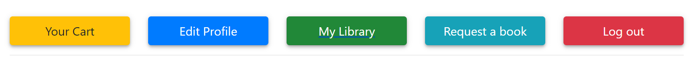
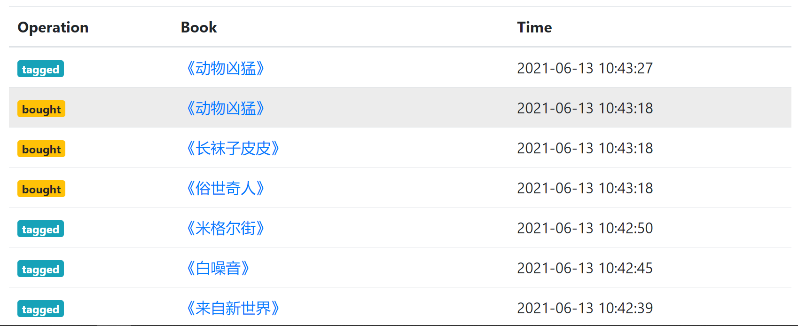
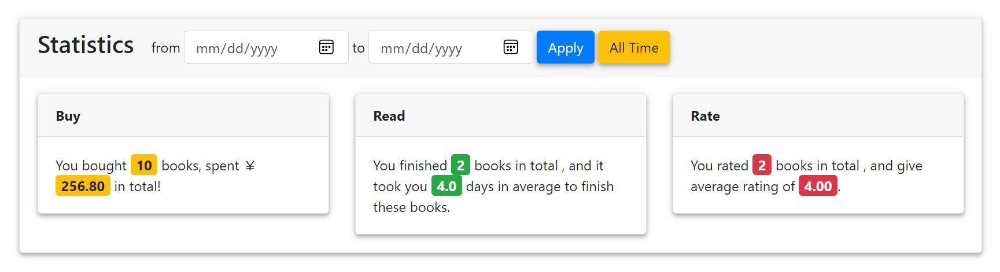

# 网页结构

[[Report]]

---

本实验项目我们开发的是一个 Web 应用, 因此所有的功能均基于网页/页面实现. 现给出我们应用的网页结构示意图

图中每个结点是一个页面, 节点名是页面的**函数名**, 箭头代表着可跳转方向. 其中灰色结点为访问方法只有 `POST` 无 `GET` 的页面, 它们也没有可视化页面; 蓝色结点为所有用户, 包括游客, 可以访问的页面; 黄色结点为专属书友的页面; 红色结点为专属馆长的页面.

从该图中可以看到, 本应用的实际中心是<b>[[书籍页面]]</b>, 这首先是因为该页面可进行的操作最多, 而且所有出现书名的地方都可以跳转到相应的[[书籍页面]].

另外, 该网页结构图并未包含导航栏 (navbar) 的跳转箭头. 在任何页面用户都可以从导航栏回到[[主页]] (home). 用户登录为书友后可随时从导航栏回到[[书友面板]] (profile); 登录为馆长后可随时从导航栏回到[[馆长面板]]. 登录用户可随时从导航栏登出.

## 统一模板与功能性 UI

下面我们简单介绍一下本应用的 UI 设计. 得益于 Jinja2 的 HTML 模板和宏 (macro) 功能, 以及 Bootstrap 的 CSS 框架, 我们构建了风格统一, 简洁易懂的**功能性** UI. 本应用采用非常少的 UI 元素, 可以概括为以下 4 种

| Element | Example                     |
| ------- | --------------------------- |
| Forms   | &#8203;   |
| Buttons | &#8203; |
| Tables  | &#8203;   |
| Cards   | &#8203;   |

其中表单 (forms) 和按钮 (buttons) 用于数据的传入与网页跳转, 表格 (tables) 和卡片 (cards) 用于数据的呈现.

之所以称之为**功能性** UI, 除了因为其能够很好地引导用户并辅助用户完成各种操作外, 还因为我们根据呈现数据的性质来选择相应的呈现格式. 对于相对独立, 重要的数据结果, 我们选择以**卡片**的形式呈现, 如书籍卡片, 统计信息卡片等; 而对于多条数据一起出现, 数据之间相关性高, 需要进行对比, 或者有明显 "二维结构" 的数据结果, 我们选择以**表格**的形式呈现, 如用户活动列表, 销售信息等.

此外以卡片为主要 UI 元素还在某种程度上提高了应用的[[可拓展性]]. 因为每张卡片可以看作一个**模块**, 其既可以灵活放置, 也可以容易处理显示信息的增添与删除. 我们将在[[可拓展性]]部分详述这种特性.