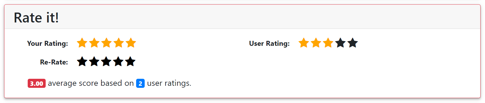

# 评分

[[Report]]

---

/+ Code

此部分对应的代码为 `book.py` 中的 `rate()` 函数.

+/

书友可以对书籍进行的另一大标记是**评分**, 评分值域为整数 1-5. [[书籍页面]]会显示书友对该书籍的评分, 书友也可以随时修改该评分.

应用通过调用数据库中的函数 `change_rating()` 来创建或修改一个评分. 具体地, 函数会会先检查该用户是否满足 **"评分限制 (rate constraint)"**, 然后再调用储存过程 `rating` 来完成表格修改. 这里的 "评分限制" 指的是**书友必须先标记一本书为 "已读", 才能对这本书评分**. `change_rating()` 与 `rating` 的具体定义与 `change_tag()` 和 `tagging` 类似, 这里不再重复展示.
