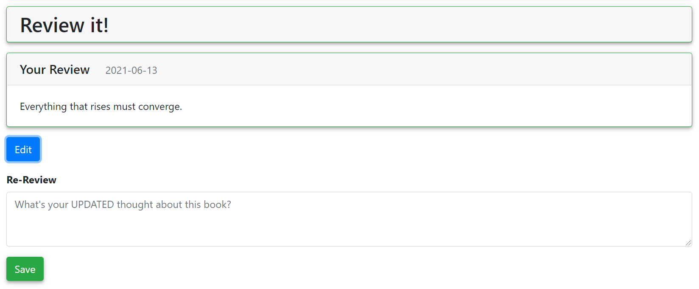

# 评论

[[Report]]

---

/+ Code

此部分对应的代码为 `book.py` 中的 `review()` 函数.

+/

除[[评分]]外, 书友对一本书的另一种评价方式是**评论**, 即撰写书评. [[书籍页面]]会显示书友对该书籍的评论, 书友也可以随时修改评论.

应用通过调用数据库中的函数 `change_review()` 来创建或修改一个评论. 具体地, 函数会会先检查该用户是否满足 **"评论限制 (rate constraint)"**, 然后再调用储存过程 `reviewing` 来完成表格修改. 这里的 "评论限制" 同 "评分限制", 即书友必须先标记一本书为 "已读", 才能评论此书. `change_review()` 与 `reviewing` 的具体定义与 `change_tag()` 和 `tagging` 类似, 这里不再重复展示.
