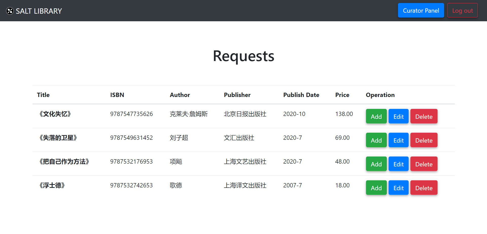

# 请求管理

[[Report]]

---

/& Page

此部分对应的页面信息为

* Page title: Requests
* Route: `/requests`

&/

/+ Code

此部分对应的代码为

* `curator.py` 中的 `requests()` 函数
* `requests.html`

+/

下面我们介绍馆长另一大重点功能/职责, 即处理**请求**, 这也是请求系统的后半部分 (前半部分由书友操作, 请见[[请求书籍]]). 请求管理页面如下, 即一张列出表 *requested_books* 中所有被请求书籍的信息的表格



对于每本被请求书籍, 馆长有三个选项:

1. 直接添加 Add, 即直接将该书的信息添加到表 *books* 中, 对应 `curator.py` 中的 `add_request()` 函数.
2. 编辑 Edit, 进入[[添加新书]]界面, 并自动填入书友已填写信息.
3. 拒绝 Delete, 即拒接该请求, 对应 `curator.py` 中的 `turndown()` 函数.

对于前两个按钮, 应用执行的其实只有**添加新书**这一操作, 而并不涉及 *request*, *requested_books* 两张表的修改. 对于第三个按钮, 应用执行的操作是更新 *request* 表中对应记录的请求状态 *request_state* 为 3, 即 "已拒绝 (turned down)". 而其他过程 - 添加新书后将请求状态更新为 "已添加 (added)" 和请求状态变为 "已添加" 或 "已拒绝" 后删除 *requested_books* 中对应信息 - 则由数据库内**触发器 (triggers)**来完成.

这里涉及两个触发器: `update_request_state` 和 `delete_requested_book`. 其中前者的内容为一旦有任何新书添加, 则将表 *request* 中对应的记录 (若有) 的请求状态 *request_state* 更新为 2, 即 "已添加", 具体定义如下

```sql
/**
 * Request State Trigger
 * auto change the request state after any new book is added into table books
 * if that book is requested
 */
CREATE OR REPLACE FUNCTION change_request_state()
RETURNS TRIGGER AS $$
BEGIN
    /* Change the request state if the newly added book is in the requests */
    UPDATE request
    SET request_state = 2
    WHERE isbn = NEW.isbn;
    RETURN NEW;
END;
$$ LANGUAGE plpgsql;
/* trigger */
CREATE TRIGGER update_request_state AFTER INSERT ON books
FOR EACH ROW
EXECUTE PROCEDURE change_request_state();
```

另一个触发器 `delete_requested_book` 的内容是, 一旦有请求的请求状态 *request_state* 变为 2 ("已添加") 或 3 ("已拒绝"), 则删除表 *requested_books* 中对应书籍数据, 具体定义如下

```sql
/**
 * Requested Book Trigger
 * auto remove the information of a requested book after 
 * the request state of that book is changed to "added" or "turned down"
 */
CREATE OR REPLACE FUNCTION delete_requested_book_fun()
RETURNS TRIGGER AS $$
BEGIN
    /* remove the requested book if its request state
    is changed to "added" or "turned down" */
    DELETE FROM requested_books
    WHERE isbn = NEW.isbn AND NEW.request_state IN (2,3) ;
    RETURN NEW;
END;
$$ LANGUAGE plpgsql;
/* trigger */
CREATE TRIGGER delete_requested_book AFTER UPDATE ON request
FOR EACH ROW
EXECUTE PROCEDURE delete_requested_book_fun();
```

这里选择使用触发器, 而不是过程或函数, 来实现功能并不是仅仅为了完成实验要求, 实际上这里只有使用触发器才更合理. 首先使用触发器 `update_request_state` 最简单的原因就是, 馆长并不是只有在管理请求的时候会[[添加新书]], 而是在任何时候, 有无请求的情况下都可以添加. 而我们希望图书馆**无论什么情况**下一旦引进了新书, 请求系统中若有对应的记录, 则其请求状态更新为 "已添加". 很显然, 这是一个适合触发器自动完成的工作.

其次, 既然一部分请求状态更新由触发器完成, 那么状态一旦更新立即删除 *requested_books* 中记录的工作也适合由触发器 `delete_requested_book`.

* 一旦, 不关心引发原因, 可以有多种引发原因, 可以由另一个触发器引发. 而前者都是由明确的书友操作引发, 因此不适合触发器
* 无需人工输入/补充信息, 自动化, 前者都有额外信息需要输入