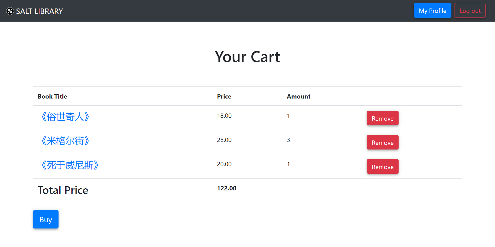

# 购物车

[[Report]]

---

/& Page

此部分对应的页面信息为

- Page title: Cart
- Route: `/cart`

&/

/+ Code

此部分对应的代码为

- `miner.py` 中的 `cart()` 函数
- `cart.html`

+/

前面我们已经介绍了书友可以从[[书籍页面]]添加书籍到购物车并进入购物车界面, 书友也可以从[[书友面板]]进入购物车页面. 购物车页面以表格的形式列出了书友添加到购物车的所有书籍, 并计算出**总价 (Total Price)** 并提供两种按钮

- 移除书籍 Remove
- 全部购买 Buy



顾名思义, 前者将对应记录从表 _cart_ 中删除; 后者调用数据库内储存过程 `buying` 完成购买操作, 之后跳转到[[我的图书馆]]页面. `buying` 的定义为

```sql
/**
 * Buy procedure
 * 1. Insert tuples into *marks*
 * 2. Insert tuples into *buy*
 * 3. Remove tuples from *cart*
 */
CREATE OR REPLACE PROCEDURE buying(IN id_in VARCHAR)
AS $$
BEGIN
    WITH
        /* Create temporary buy information table */
        buy_info(isbn, id, bought_num, operation, buy_time) AS (
            SELECT isbn, id, cart_num, 1, CURRENT_TIMESTAMP FROM cart WHERE id=id_in
        ),
        /* Insert tuples into marks */
        r AS (
            INSERT INTO marks(isbn, id, operation)
                (SELECT isbn, id, operation FROM buy_info)
                RETURNING mark_id, isbn
        )

    /* Insert tuples into buy */
    INSERT INTO buy(mark_id, bought_num)
        (SELECT r.mark_id, bought_num FROM r NATURAL JOIN buy_info);

    /* Empty the cart */
    DELETE FROM cart
    WHERE id=id_in;
END;
$$ LANGUAGE plpgsql;
```

整个过程分为三步:

1. 添加记录到表 *marks*
2. 添加记录到表 *buy*
3. 清空购物车表 *cart*

与之前的几个过程不同的是, 这个过程是为**一次处理多条记录**设计的. 具体地, 过程中先用 `WITH` 语句将购物车内所有数据转化为了一个临时表 `buy_info`, 再利用其以表的形式向 `marks` 和 `buy` 一次性插入了多条数据.

~~ 关于为何将购买系统拆分为[[加入购物车]]和购买两个操作, 请见前述 ;;[[E-R 模型设计#Cart & Buy]];;.

另外, [[评分|前面]]已经提到过, 任何购买完成后, 我们用一个表 *buy* 上的一个触发器来更新书籍的 *sold* 属性. 触发器 `update_sold` 的内容与 `update_u_rating` 类似, 分为获得书籍 ISBN 码和更新属性 *sold* 两步, 其具体定义不再赘述.
