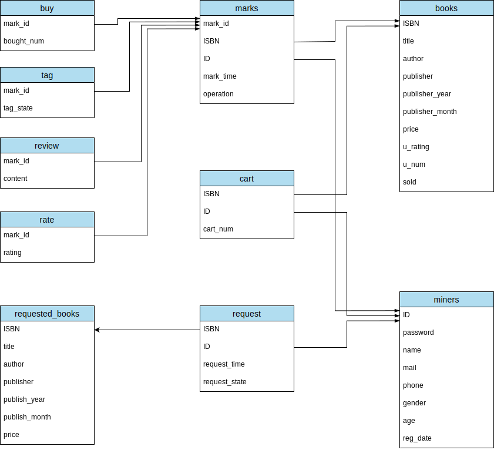

# 转化为关系模式

[[Report]]

related:: [[E-R 模型设计]]

---

现在我们将数据库的 E-R 模型转化为具体的关系模式表

$$\begin{aligned}
&books (\underline{ISBN}, title, author, publisher, publish\_year, pulish\_month, price, u\_rating, u\_num, sold)\\
&miners (\underline{ID}, password, name, mail, phone, gender, age, reg\_date)\\
&requested\_books (\underline{ISBN}, title, author, publisher, publish\_year, pulish\_month, price)\\
&request (\underline{ISBN}, \underline{ID}, request\_time, request\_state)\\
&cart (\underline{ISBN}, \underline{ID}, cart\_num)\\
&marks (\underline{\smash{mark\_id}},ISBN, ID, mark\_time, operation)\\
&buy (\underline{\smash{mark\_id}}, bought\_num)\\
&tag (\underline{\smash{mark\_id}}, tag\_state)\\
&review (\underline{\smash{mark\_id}}, content)\\
&rate (\underline{\smash{mark\_id}}, rating)
\end{aligned}$$

其对应模式图如下

接下来我们来看两个具体的转化细节.

第一我们取消了实体 *all_books*, 只保留了它的两个特化 *books* 和 *requested_books*. 这个选择是基于一个重要的假设: 所有用户与已有书籍之间互动量远大于书友对缺失书籍的请求. 这个假设既符合实际, 又跟我们应用背后的哲学相一致, 即我们更关注书友与图书馆已有书籍的互动. 基于这个假设, 我们可以知道表 *books* 需要被大量访问, 而 *requested_books* 相对较少. 因此如果我们继续保留 *all_books*, 即将已有书籍和请求书籍的数据储存在一起的话, 每次读取已有书籍的信息就要涉及 *all_books* 整张表, 效率会明显降低. 此外, 用户与已有书籍和互动和书籍请求系统的逻辑不同, 对于已有书籍用户只是进行**查询**信息, 而对于请求书籍书友则是负责**写入**信息, 据此两张表用户的权限也应该不同. 总之我们希望图书馆的互动系统和请求系统相对独立, 因此在[[E-R 模型设计|E-R 模型]]转化为关系模式的时候省略 *all_books* 仅保留 *books* 和 *requested_books* 两个独立的表是更加合理的.

第二点在 [[E-R 模型设计|E-R 图]]中也体现了. 首先因为 *marks* 是个 **多对多** 的关系, 因此在将它聚集为实体的时候我们需要手动添加主码 *mark_id*, 这里我们采用 PSQL 自动生成的 **serial keys** 作为 *mark_id*, 这样 *mark_id* 和 *mark_time* 是一致的. 其次, 我们添加了一个描述性属性 *operation*, 它的值域就是 $\{buy, tag, review, rate\}$. 这个属性似乎是多余的, 因为每种操作已经有一个独立的特化表了. 但其实这个属性是方便我们建立**索引**. 通过在属性对 (*operation*, *mark_id*) 上建立索引, 我们就能在索引层面上将 *marks* 中每种操作储存在一起, 达到近似分别创建了四张表的效果, 也能提高系统的效率.