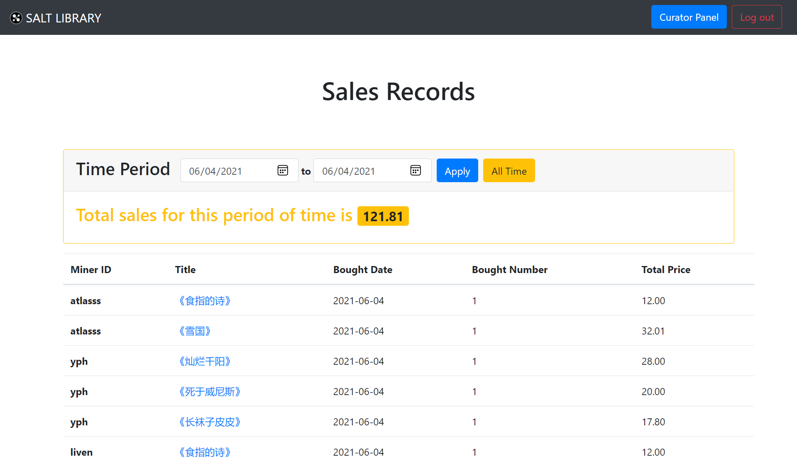

# 销售管理

[[Report]]

---

/& Page

此部分对应的页面信息为

* Page title: Sales Records
* Route: `/sales`

&/

/+ Code

此部分对应的代码为

* `curator.py` 中的 `sales()` 函数
* `sales.html`

+/

销售管理的页面跟[[书籍管理]]的页面布局一样, 且默认显示所有销售记录. 销售记录由查询视图 *buy_view* 得到, 并计算了每条记录的**总价 (Total Price)**, 按时间降序排列.

这里我们没有设置复杂的过滤器选项, 而只给出了**起始时间**这一条件. 而统计信息卡片显示的是给定时间段内图书馆的销售总额.

:> 06/04/2021 当天的销售记录 <:
