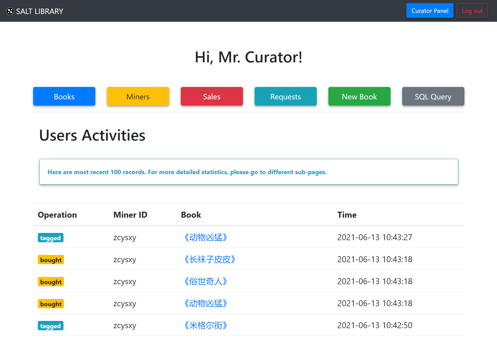

# 馆长面板

[[Report]]

---

/& Page

此部分对应的页面信息为

* Page title: Curator Panel
* Route: `/newbook`

&/

/+ Code

此部分对应的代码为

* `book.py` 中的 `newbook()` 函数
* `newbook.html`

+/

馆长面板与[[书友面板]]类似, 作为馆长的 "主页" 由主要功能按钮和书友活动信息组成. 这里的用户活动列表不再是某个书友的活动, 而是**所有书友的最近一百条活动**, 活动记录由查询视图 `mark_book_view` 得到. 与[[书友面板]]不同的是, 因为馆长有专门的管理页面来查看各种统计信息, 故馆长面板不再设置时间过滤器也不显示相关的统计信息.

