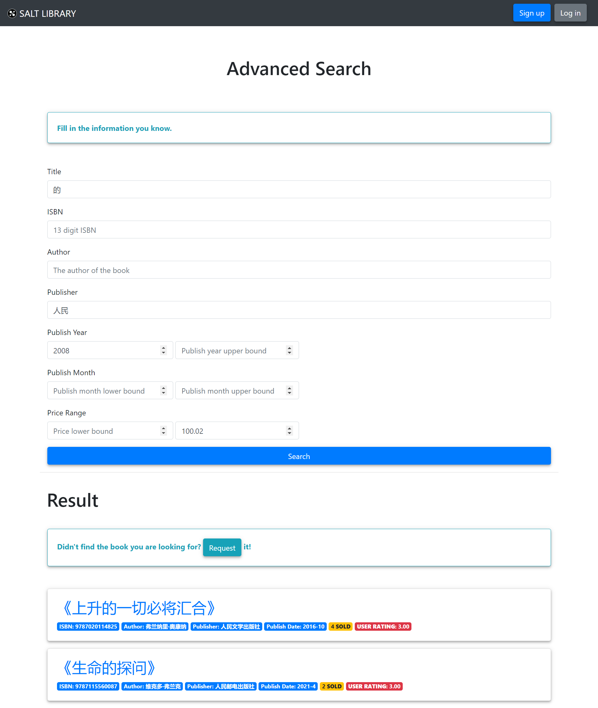

# 高级搜索

[[Report]]

---

/& Page

此部分对应的页面信息为

* Page title: Advanced Search
* Route: `/ad_search`

&/

/+ Code

此部分对应的代码为

* `book.py` 中的 `ad_search()` 函数
* `ad_search.html`

+/

可以看到所有[[模糊搜索|搜索栏]]旁都有一个高级搜索 (Advanced Search) 的按钮, 这是本应用第二种搜索方式, 提供最全面, 最灵活的搜索机制. 高级搜索有单独的输入界面, 界面如下


:> 搜索条件为: 书名包括 "的"; 出版社名包括 "人民"; 出版年份不早于 2008 年; 售价不高于 100.02 元, 的搜索结果 <:

高级搜索的搜索其实是 HTML form 的传递加 SQL 查询语句中**谓词的叠加**, 一个示例叠加代码如下

```python
if request.form['max_publish_year']:
    max_publish_year = request.form['max_publish_year']
    query = query + ' publish_year <= %s AND'
    value_list.append(max_publish_year)
```

即如果用户输入了 "最大出版年份" (对应 HTML form 中的 "Publish year upper bound") 的值, 则在 `query` 中加入一个条件 `publish_year <= max_publish_year`, 其中 `max_publish_year` 由 `value_list` 在执行 SQL 命令时传递给 query. 其中基础 query 如下

```sql
SELECT * FROM books WHERE
```

可以看出, 高级查询是在最基础的语句上叠加搜索条件实现的, 所以非常灵活, 几乎能够完成书籍任何信息的匹配.